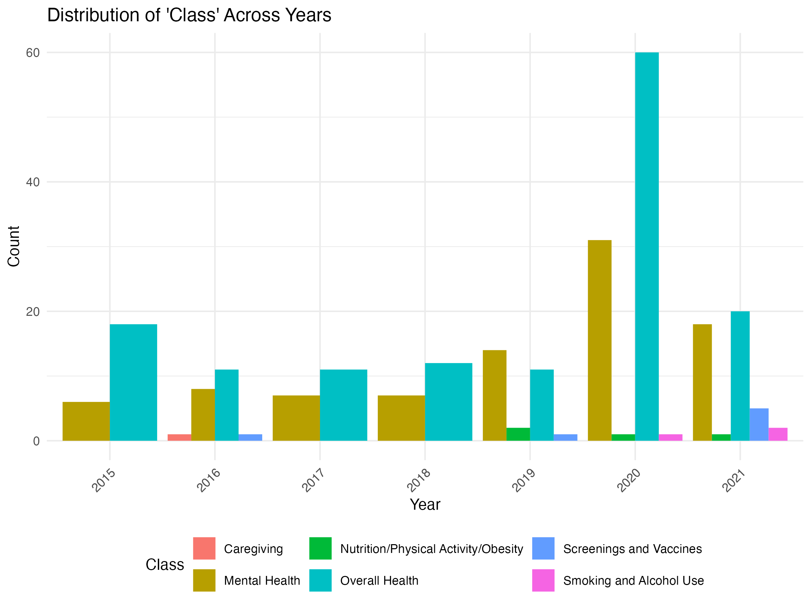

```{r setup, include=FALSE}
knitr::opts_chunk$set(echo = FALSE)
library(here)
```

## Introduction
The most prevalent kind of dementia, Alzheimer's is a degenerative illness that affects about millions individuals. The areas of the brain responsible for cognition, memory, and language are affected by Alzheimer's disease. It may significantly impair a person's capacity to do everyday tasks. It starts with modest memory loss and progresses to include loss of conversational flow and environmental awareness.

The data has a total of 16 columns and 250937 observations. It covers older adults in 59 locations across the US. The dataset has variables that range from demographics (age, gender, ethnicity) to health behaviors (nutrition, physical activity, smoking, and alcohol use), care-giving status, and records of medical screenings.

The following basic general prevalence of Alzheimer's disease across various years and places will be found by this current part of the project. Next, we look at how Alzheimer's class cases are distributed throughout time. Additionally, maps were made to show the geographical distribution of Alzheimer's cases and pinpoint areas with varying incidence rates.

Overall Statistics: 

```{r, echo= FALSE}
overall_stats <- readRDS(here::here("report", "overall_stats.rds"))
knitr::kable(overall_stats, format = "html", caption = "Table 1: Overall Statistics of Data Value")
```

## Gender and Ethnicity Breakdown
Women and men are the same count, and "white" as a big part of the ethnicity, followed by "Hispanic".

```{r, echo=FALSE}
categorical_breakdown <- readRDS(here::here("report", "categorical_breakdown.rds"))
knitr::kable(categorical_breakdown, format = "html", caption = "Table 2: Breakdown by Categorical Variables")
```

## Distribution of Class Across Years

Here is the bar plot, taking a look at the proportion of class across years.

```{r plot-image, echo=FALSE, results='asis'}
cat('')
```

## Conclusion
In conclusion, this report provides an overview of the prevalence and distribution of Alzheimer's disease based on the available data. The analysis highlights the overall statistics, gender and ethnicity breakdown, and the distribution of Alzheimer's cases across different years. The interactive map allows for the visualization of the geographical distribution of cases. Further analysis can be conducted to explore the relationships between various factors and the occurrence of Alzheimer's disease.
